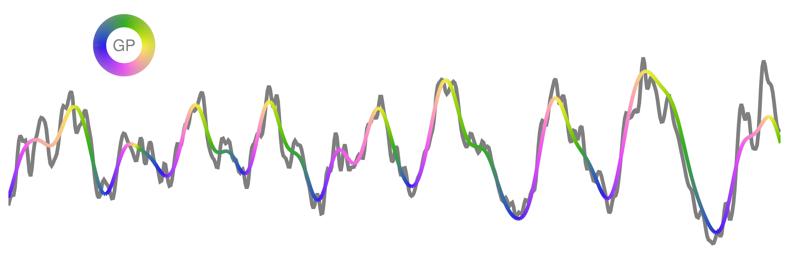

# GeneralizedPhase.jl
Implement [mullerlab/generalized-phase](https://github.com/mullerlab/generalized-phase) in Julia



### Usage
```
using GeneralizedPhase
t = 0.001:0.001:10
fs = 1/step(t)
x = [sin.(a.*t) for a in [10, 11, 12, 13, 14]] |> sum

𝜑 = _generalized_phase(x, fs) # Calculate the interpolated analytic phase
𝜑 = generalized_phase(x, fs) # Apply a broad-band filter before interpolating phase
```
